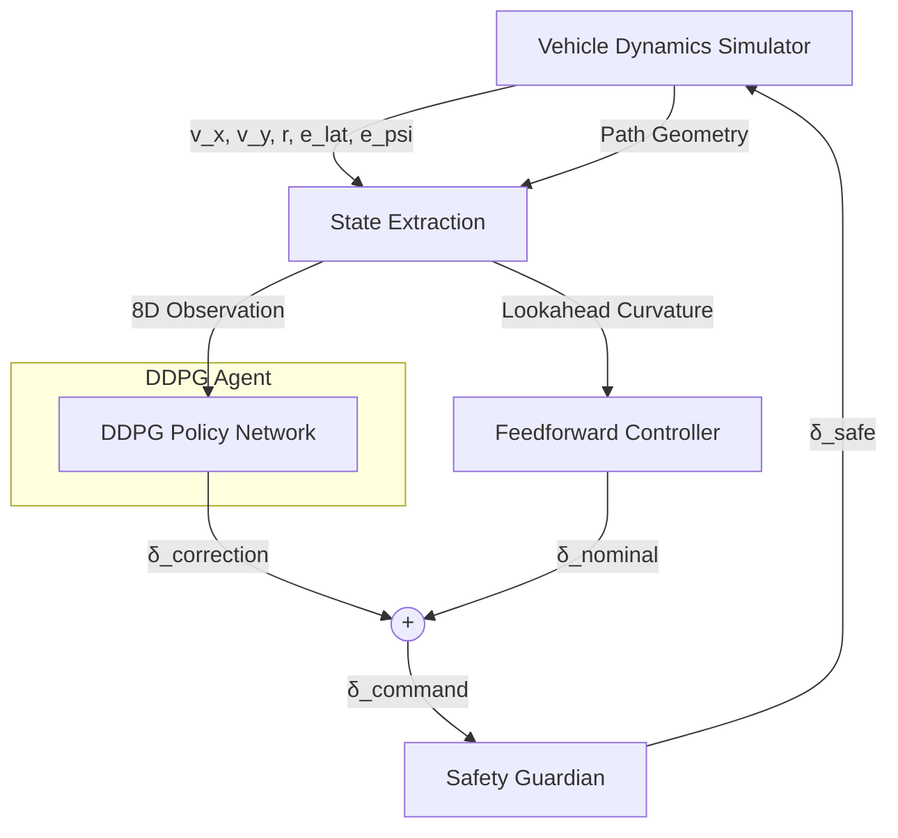
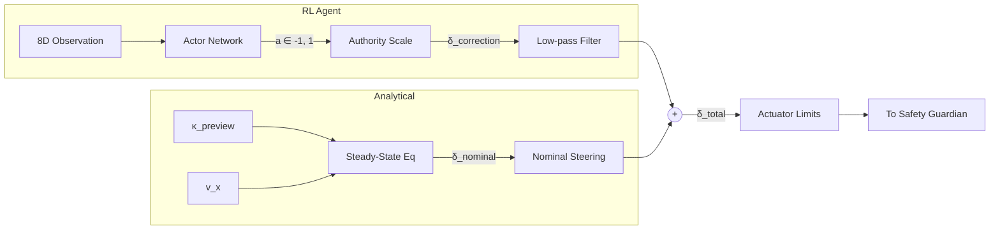

# Chapter 3: Methodology

## 3.1 Overview of the Proposed System

This chapter presents the complete design, implementation, and training methodology of an autonomous lane keeping system built upon the Deep Deterministic Policy Gradient (DDPG) reinforcement learning algorithm. The system integrates a high-fidelity vehicle dynamics simulator, a multi-source data fusion pipeline, and a standards-compliant evaluation framework to produce a lane keeping controller that is assessed against ISO 15622:2018, IEEE 2846-2022, and UNECE WP.29 R157 safety requirements.

The methodology is organised into the following subsections: the vehicle dynamics model (Section 3.2), the simulation environment and road scenarios (Section 3.3), the reinforcement learning agent architecture (Section 3.4), the reward function design (Section 3.5), the training pipeline including curriculum learning and data fusion (Section 3.6), the safety supervision system (Section 3.7), domain randomisation for sim-to-real transfer (Section 3.8), and the evaluation protocol with formal metrics definitions (Section 3.9). Every parameter, equation, and design decision is documented to a level of detail sufficient for independent replication.

The overall system architecture is illustrated conceptually in Figure 3.1. At the highest level, the system operates as a feedback control loop: the environment produces an 8-dimensional observation vector describing the vehicle's lateral state; the DDPG agent maps this observation to a 1-dimensional steering correction; a feedforward controller adds a nominal steering angle computed from road curvature; a safety guardian enforces physical constraints on the combined command; and the vehicle dynamics model integrates the resulting steering input to produce the next state.

**Figure 3.1: System Architecture Overview**


---

## 3.2 Vehicle Dynamics Model

### 3.2.1 Nonlinear Bicycle Model

The vehicle is modelled using the nonlinear bicycle model, a widely accepted representation for lateral vehicle dynamics that collapses the four-wheel vehicle into an equivalent two-wheel system at the front and rear axles. The formulation follows Rajamani (2012), Chapter 3, Equations 3.6–3.11.

The state vector comprises eight variables:

**x** = [X, Y, ψ, v_x, v_y, r, e_lat, e_ψ]^T

where:
- X, Y — global position coordinates (m)
- ψ — yaw angle (rad)
- v_x — longitudinal velocity (m/s), held constant at the reference speed
- v_y — lateral velocity (m/s)
- r — yaw rate (rad/s)
- e_lat — lateral deviation from the lane centreline (m)
- e_ψ — heading error relative to the road tangent (rad)

### 3.2.2 Tyre Force Model

The lateral tyre forces are computed using a linear cornering force model. The front and rear slip angles are:

α_f = arctan((v_y + l_f · r) / v_x) − δ

α_r = arctan((v_y − l_r · r) / v_x)

where δ is the front wheel steering angle, l_f = 1.105 m is the distance from the centre of mass (CoM) to the front axle, and l_r = 1.738 m is the distance from the CoM to the rear axle. The total wheelbase is L = l_f + l_r = 2.843 m.

The lateral forces are then:

F_yf = −C_αf · α_f

F_yr = −C_αr · α_r

where C_αf = 88,000 N/rad and C_αr = 94,000 N/rad are the nominal front and rear axle cornering stiffness values, respectively. These values represent a BEV midsize sedan (representative of a BYD Seal or Tesla Model 3 class vehicle) and are sourced from Rajamani (2012), Table 3.2. To prevent division by zero at low speeds, v_x is clamped to a minimum of 0.5 m/s in the slip angle computation.

### 3.2.3 Equations of Motion

The state derivatives are:

Ẋ = v_x · cos(ψ) − v_y · sin(ψ)

Ẏ = v_x · sin(ψ) + v_y · cos(ψ)

ψ̇ = r

v̇_x = 0 (constant speed assumption)

v̇_y = (F_yf + F_yr) / m − v_x · r

ṙ = (l_f · F_yf − l_r · F_yr) / I_z

ė_lat = v_x · sin(e_ψ) + v_y · cos(e_ψ)

ė_ψ = r − κ_ref · v_x

where m = 1,650 kg is the vehicle mass, I_z = 2,315.3 kg·m² is the yaw moment of inertia, and κ_ref is the reference road curvature at the current position along the path.

### 3.2.4 Numerical Integration

The equations of motion are integrated using the fourth-order Runge-Kutta (RK4) method at a fixed timestep of dt = 0.01 s (100 Hz). RK4 was chosen over Euler integration because first-order methods introduce unacceptable energy drift in the lateral dynamics at 100 Hz, particularly during high-curvature manoeuvres. The RK4 update rule is:

k₁ = f(x_n, u)
k₂ = f(x_n + (dt/2)·k₁, u)
k₃ = f(x_n + (dt/2)·k₂, u)
k₄ = f(x_n + dt·k₃, u)
x_{n+1} = x_n + (dt/6)·(k₁ + 2k₂ + 2k₃ + k₄)

After each integration step, the yaw angle ψ and heading error e_ψ are wrapped to the range [−π, π] to prevent angle accumulation. The steering input δ is clamped to ±0.35 rad (±20°), which represents the physical hardware limit of the steering actuator at 60 km/h.

### 3.2.5 Vehicle Parameters

Table 3.1 summarises all vehicle dynamics parameters used in the simulation.

| Parameter | Symbol | Value | Unit | Source |
|-----------|--------|-------|------|--------|
| Vehicle mass | m | 1,650 | kg | BEV midsize sedan kerb weight |
| Yaw moment of inertia | I_z | 2,315.3 | kg·m² | Rajamani (2012) Table 2.1 |
| CoM to front axle | l_f | 1.105 | m | NHTSA NCAP geometry |
| CoM to rear axle | l_r | 1.738 | m | NHTSA NCAP geometry |
| Total wheelbase | L | 2.843 | m | l_f + l_r |
| Front cornering stiffness | C_αf | 88,000 | N/rad | Rajamani (2012) Table 3.2 |
| Rear cornering stiffness | C_αr | 94,000 | N/rad | Rajamani (2012) Table 3.2 |
| Reference speed | V_ref | 16.67 | m/s | 60 km/h (ISO 15622 test speed) |
| Lane width | W_lane | 3.50 | m | EU standard lane width |
| Max steering angle | δ_max | 0.35 | rad | ±20° at operating speed |
| Integration timestep | dt | 0.01 | s | 100 Hz physics update |
| Max episode steps | N_max | 3,000 | steps | 30 s maximum episode duration |

---

## 3.3 Simulation Environment and Road Scenarios

### 3.3.1 Environment Design

The simulation environment follows the Gymnasium (formerly OpenAI Gym) interface standard, implementing the `reset()` and `step()` methods that return observations, rewards, and termination signals. This standardised interface ensures compatibility with any reinforcement learning algorithm.

The environment supports two physics backends:

1. **Bicycle model backend** (default): Uses the nonlinear bicycle model described in Section 3.2 with RK4 integration. This backend requires no external dependencies and runs at approximately 50,000 simulation steps per second on a modern CPU, making it suitable for bulk training.

2. **CARLA backend**: Interfaces with the CARLA 0.9.16 open-source driving simulator, which uses NVIDIA PhysX for 4-wheel vehicle dynamics. This backend is used for high-fidelity validation but is not required for training.

Both backends produce the same 8-dimensional normalised observation vector and accept the same 1-dimensional normalised action, enabling seamless policy transfer between them.

### 3.3.2 Observation Space

The observation vector is 8-dimensional, with each component normalised to the range [−1, 1] using physics-based divisors (not data-driven statistics). This guarantees zero distribution shift between simulated and real-world observations.

| Index | Component | Normalisation Divisor | Physical Meaning |
|-------|-----------|----------------------|------------------|
| 0 | e_lat / 1.75 | Half lane width (m) | Lateral error |
| 1 | e_ψ / (π/4) | 45° (rad) | Heading error |
| 2 | κ / 0.05 | Max curvature (1/m) | Current road curvature |
| 3 | v_y / 2.0 | Max lateral velocity (m/s) | Lateral velocity |
| 4 | r / 0.5 | Max yaw rate (rad/s) | Yaw rate |
| 5 | δ_prev / 0.35 | Max steering angle (rad) | Previous steering command |
| 6 | κ_la1 / 0.05 | Max curvature (1/m) | Curvature at 1 s lookahead |
| 7 | κ_la2 / 0.05 | Max curvature (1/m) | Curvature at 2 s lookahead |

The lookahead curvatures (κ_la1, κ_la2) are computed by interpolating the road curvature profile at positions s + v_x · 1.0 and s + v_x · 2.0 metres ahead, where s is the current arc length along the path. These provide the agent with anticipatory information about upcoming road geometry, analogous to a human driver looking ahead.

During training, Gaussian observation noise with standard deviation σ_obs = 0.02 (2% of the normalised range) is added to each dimension to simulate real sensor noise (camera lane detection uncertainty, IMU noise, curvature estimation error). Observations are clipped to [−1, 1] after noise injection.

### 3.3.3 Action Space

The action space is 1-dimensional continuous, representing a normalised steering **correction** in the range [−1, 1]. This correction is combined with a feedforward nominal steering angle to produce the total steering command, as described in Section 3.3.4.

### 3.3.4 Feedforward-Feedback Control Architecture

A critical design decision is the decomposition of the steering command into a feedforward nominal component and a feedback correction component:

δ_total = δ_nominal + δ_correction

The **feedforward component** uses the steady-state steering equation from the bicycle model:

δ_nominal = L · κ_preview + K_us · v_x² · κ_preview

where K_us is the understeer gradient:

K_us = (m / L) · (l_r / C_αf − l_f / C_αr)

and κ_preview is the road curvature at a preview distance of v_x · t_preview ahead of the current position, with t_preview = 0.8 s. This preview-based feedforward naturally handles dynamic curvature changes by steering anticipatorily.

The **feedback component** is the RL agent's output, scaled by the correction authority:

δ_correction = a · α_correction · δ_max

where a ∈ [−1, 1] is the agent's normalised action, α_correction = 1.0 (full authority), and δ_max = 0.35 rad. This architecture dramatically reduces the agent's learning burden: the feedforward handles the bulk of the steering on curved roads, while the agent only needs to learn small corrective adjustments for disturbance rejection and error correction.

An exponential moving average (EMA) low-pass filter is applied to the agent's raw action to prevent high-frequency oscillations:

a_filtered = α · a_raw + (1 − α) · a_prev

where α = 0.7 is the smoothing coefficient.

The total command is clamped to [−δ_max, δ_max] before passing through the safety guardian.

**Figure 3.2: Feedforward-Feedback Steering Control Flow**


### 3.3.5 Episode Termination

An episode terminates under two conditions:

1. **Terminated** (lane departure): |e_lat| ≥ 1.75 m (half lane width). The agent receives a terminal penalty of −10.0.
2. **Truncated** (time/distance limit): The step count reaches 3,000 (30 s) or the vehicle reaches the end of the road profile.

### 3.3.6 Road Scenarios

Five road scenarios are defined, covering the full range of geometries specified in ISO 15622:2018 and ISO 3888-2:2011. Each scenario is represented as a discretised centreline geometry at ds = 0.1 m resolution, stored as arrays of arc length, X/Y coordinates, heading angle, curvature, and target speed.

**SCN-01: Straight Road (ISO 15622:2018 §8.1)**
A 300 m straight road with zero curvature at constant speed (60 km/h). This baseline scenario is used for initial controller tuning and convergence assessment.

**SCN-02: Constant Radius Curve (ISO 15622:2018 §8.2)**
Total length 500 m. Geometry: 150 m straight → 20 m clothoid entry (linear curvature ramp from 0 to κ) → 160 m constant-radius arc at R = 80 m (κ = 0.0125 1/m) → 20 m clothoid exit → 150 m straight. The radius R = 80 m is the minimum curve radius for 60 km/h per the AASHTO Green Book §3-4. The 20 m clothoid transitions prevent discontinuous curvature steps that would cause unphysical transient overshoot.

**SCN-03: Sinusoidal Winding Road (ISO 15622:2018 §8.3)**
Total length 400 m. Curvature profile: κ(s) = 0.02 · sin(2π · s / 100), producing a continuously varying curvature with peak values of ±0.02 1/m (equivalent to R = 50 m) and wavelength 100 m. This tests the agent's ability to track dynamically changing curvature.

**SCN-04: Double Lane Change (ISO 3888-2:2011)**
Total length 175 m. Exact geometry per ISO 3888-2:2011: 50 m approach straight → 25 m first lane change (3.5 m lateral offset, sinusoidal displacement profile) → 25 m corridor at offset → 25 m return lane change → 50 m exit straight. The sinusoidal lateral displacement profile y(s) = (Δy/2)·(1 − cos(π·s_local/L_change)) provides smooth curvature variation. The curvature is derived analytically: κ = d²y/ds² / (1 + (dy/ds)²)^(3/2).

**SCN-05: Combined Urban Profile**
Total length 360 m. Geometry: 80 m straight → 100 m curve at R = 60 m → 40 m straight → 30 m S-bend first half at R = 40 m → 30 m S-bend second half at R = 40 m (opposite sign) → 80 m straight. All curvature transitions use 10 m clothoid ramps. The speed profile varies: 50 km/h (13.89 m/s) on straights, reduced to 30 km/h (8.33 m/s) through tight curves, with 15 m cosine-smoothed transition zones.

Table 3.2 summarises the key parameters of each scenario.

| Scenario | Length (m) | κ_max (1/m) | R_min (m) | Speed (km/h) | ISO Reference |
|----------|-----------|-------------|-----------|---------------|---------------|
| SCN-01 | 300 | 0.000 | ∞ | 60 | ISO 15622 §8.1 |
| SCN-02 | 500 | 0.0125 | 80 | 60 | ISO 15622 §8.2 |
| SCN-03 | 400 | 0.020 | 50 | 60 | ISO 15622 §8.3 |
| SCN-04 | 175 | ~0.028 | ~36 | 60 | ISO 3888-2:2011 |
| SCN-05 | 360 | 0.025 | 40 | 30–50 | Euro NCAP AEB |

---

## 3.4 Reinforcement Learning Agent Architecture

### 3.4.1 Deep Deterministic Policy Gradient (DDPG)

The lane keeping controller is trained using the Deep Deterministic Policy Gradient (DDPG) algorithm, an off-policy actor-critic method designed for continuous action spaces. DDPG combines the policy gradient approach of actor-critic methods with the sample efficiency of off-policy learning via a replay buffer.

The algorithm maintains four neural networks:
1. **Online actor** μ(s|θ^μ): Maps observations to deterministic actions.
2. **Online critic** Q(s, a|θ^Q): Estimates the expected cumulative reward for a state-action pair.
3. **Target actor** μ'(s|θ^{μ'}): A slowly-updated copy of the actor used for stable target computation.
4. **Target critic** Q'(s, a|θ^{Q'}): A slowly-updated copy of the critic.

### 3.4.2 Actor Network Architecture

The actor network maps the 8-dimensional observation to a 1-dimensional steering correction:

Input(8) → Linear(400) → LayerNorm → ReLU → Linear(300) → LayerNorm → ReLU → Linear(1) → Tanh

The output is in [−1, 1], which is scaled to the physical steering correction by the environment.

**Design decisions:**

- **LayerNorm** is used instead of BatchNorm because LayerNorm normalises per sample rather than per batch. This is required for online RL where mini-batches are non-i.i.d. and batch statistics are unreliable.

- **Hidden layer widths (400, 300)** follow the architecture from the original DDPG paper.

- **Weight initialisation**: Hidden layers use fan-in uniform initialisation with bounds ±1/√(fan_in). The final output layer uses uniform [−3×10⁻³, 3×10⁻³] initialisation, which ensures a near-zero initial policy. This prevents large early steering commands that would deplete expert demonstrations from the replay buffer.

### 3.4.3 Critic Network Architecture

The critic network maps the concatenated (observation, action) pair to a scalar Q-value estimate:

[obs(8) | action(1)] → Linear(9, 400) → LayerNorm → ReLU → Linear(300) → LayerNorm → ReLU → Linear(1)

The observation and action are concatenated at the input layer. Weight initialisation follows the same scheme as the actor.

### 3.4.4 Training Update Rule

At each gradient step, the following updates are performed:

**Critic update** (every step):
1. Sample a mini-batch of 256 transitions (s, a, r, s', d) from the replay buffer.
2. Compute the target Q-value: y = r + γ · (1 − d) · Q'(s', μ'(s'))
3. Minimise the MSE loss: L_critic = (1/N) · Σ(Q(s, a) − y)²
4. Apply gradient clipping with maximum norm 1.0 to the critic gradients.

**Actor update** (every 2nd critic update — delayed policy update):
1. Compute deterministic actions: â = μ(s)
2. Maximise Q-value: L_actor = −(1/N) · Σ Q(s, â)
3. Apply gradient clipping with maximum norm 0.5 to the actor gradients.

The delayed policy update (updating the actor every 2 critic updates) follows the TD3 technique, which reduces variance in the policy gradient by allowing the critic to converge more before the actor exploits potentially noisy Q-estimates.

**Target network update** (after each actor update):
Polyak averaging with coefficient τ = 0.005:

θ' ← τ · θ + (1 − τ) · θ'

### 3.4.5 Hyperparameters

Table 3.3 lists all DDPG hyperparameters.

| Parameter | Symbol | Value | Justification |
|-----------|--------|-------|---------------|
| Actor learning rate | α_actor | 1 × 10⁻⁴ | Conservative for policy stability |
| Critic learning rate | α_critic | 1 × 10⁻³ | Faster critic learning to track shifting policy |
| Discount factor | γ | 0.99 | Horizon ~100 steps = 1.0 s at 100 Hz |
| Polyak coefficient | τ | 0.005 | Standard DDPG value |
| Batch size | N_batch | 256 | Balance between gradient variance and compute |
| Policy update frequency | f_policy | 2 | TD3-style delayed update |
| Critic gradient clip | ‖∇‖_critic | 1.0 | Prevents Q-value divergence |
| Actor gradient clip | ‖∇‖_actor | 0.5 | Prevents policy collapse |
| Warmup steps | N_warmup | 10,000 | Random exploration before learning (sim-only) |
| Updates per step | UTD | 2 | Higher ratio for sim-only mode |
| Total episodes | N_episodes | 600 | Sufficient for convergence |
| Checkpoint interval | — | 50 episodes | Periodic model saving |

**Learning rate decay**: The learning rates of both actor and critic are decayed by a factor of 0.5 at 75% (episode 450) and 90% (episode 540) of training to prevent late-training divergence.

---

## 3.5 Reward Function Design

### 3.5.1 Composite Reward Structure

The reward function comprises five components, each targeting a specific aspect of lane keeping performance. Using the same reward computation for both simulated rollouts and real-world dataset transitions ensures a consistent reward signal across the entire fused replay buffer.

The total reward at each timestep is:

r_total = w_lat · r_lat + w_head · r_head + w_smooth · r_smooth + w_prog · r_prog + r_terminal

### 3.5.2 Lateral Accuracy Reward (r_lat)

This is the dominant reward component (w_lat = 5.0) since lane keeping is the primary control objective.

r_lat = exp(−5.0 · (e_lat / (W_lane / 2))²)

This Gaussian-like exponential decay produces a reward in [0, 1], with a maximum at e_lat = 0 (perfect lane centre tracking). At the lane boundary (|e_lat| = 1.75 m), the reward drops to exp(−5) ≈ 0.007, providing a strong gradient towards the centre.

### 3.5.3 Heading Alignment Reward (r_head)

This component (w_head = 2.0) penalises heading error, which is critical for preventing overshoot during curve entry and exit.

r_head = exp(−3.0 · (e_ψ / (π/4))²)

The normalisation by π/4 (45°) means the reward drops to exp(−3) ≈ 0.05 at 45° heading error, which represents extreme misalignment.

### 3.5.4 Steering Smoothness Reward (r_smooth)

This component (w_smooth = 1.0) penalises large steering rates to enforce comfort and comply with ISO 15622:2018 §9.2.

r_smooth = exp(−0.5 · (δ̇ / 0.20)²)

where δ̇ = (δ_current − δ_previous) / dt is the steering rate. The reference value 0.20 rad/s is the IEEE 2846-2022 target for steering rate RMS, used as the Gaussian width parameter.

### 3.5.5 Forward Progress Reward (r_prog)

This small component (w_prog = 0.3) prevents the degenerate zero-speed policy that would minimise all other penalties.

r_prog = clamp(v_x · cos(e_ψ) / V_ref, 0, 1)

### 3.5.6 Terminal Penalty (r_terminal)

Applied when the episode terminates due to lane departure (|e_lat| ≥ 1.75 m):

r_terminal = −10.0

This large negative value strongly discourages the agent from approaching the lane boundary.

### 3.5.7 Reward Weight Summary

| Component | Weight | Range | Purpose |
|-----------|--------|-------|---------|
| r_lat (lateral) | 5.0 | [0, 1] | Lane centre tracking (dominant) |
| r_head (heading) | 2.0 | [0, 1] | Heading alignment |
| r_smooth (smoothness) | 1.0 | [0, 1] | Steering comfort |
| r_prog (progress) | 0.3 | [0, 1] | Prevent zero-speed collapse |
| r_terminal | — | −10.0 or 0 | Lane departure penalty |

The maximum achievable per-step reward is 5.0 + 2.0 + 1.0 + 0.3 = 8.3 (with perfect tracking, no steering rate, and full-speed progress).

---

## 3.6 Training Pipeline

### 3.6.1 Exploration Noise

Exploration is provided by an Ornstein-Uhlenbeck (OU) noise process, which generates temporally correlated noise suitable for continuous control tasks. The OU process is mean-reverting, producing smoother exploration trajectories than uncorrelated Gaussian noise — critical for vehicle steering where jerky exploration would cause unrealistic dynamics.

The discrete-time update is:

dx_t = θ · (μ − x_t) · dt + σ · √dt · N(0, 1)
x_{t+1} = x_t + dx_t

where θ = 0.15 is the mean reversion rate, μ = 0 is the long-run mean, and σ is the volatility parameter.

**Noise annealing schedule:**
- Episodes 0–50: σ = 0.20 (high exploration, sim-only mode)
- Episodes 50–400: σ linearly anneals from 0.15 to 0.03
- Episodes 400–600: σ = 0.03 (near-exploitation)

The noise is reset to zero at the start of each episode.

### 3.6.2 Replay Buffer

The system uses a ring buffer with a capacity of 700,000 transitions. In the full data-fusion pipeline (not used in the sim-only evaluation), a hybrid stratified replay buffer maintains separate sub-buffers for each data source with phase-aware sampling weights:

| Data Source | Sub-buffer Capacity | Phase 1 Weight | Phase 2 Weight | Phase 3 Weight |
|-------------|-------------------|----------------|----------------|----------------|
| OpenLKA (DS-01) | 600,000 | 0.40 | 0.30 | 0.15 |
| Comma (DS-02) | 400,000 | 0.20 | 0.15 | 0.10 |
| Argoverse (DS-03) | 300,000 | 0.20 | 0.15 | 0.10 |
| Simulation | 700,000 | 0.20 | 0.40 | 0.65 |

This stratified approach prevents expert demonstrations from being overwritten by online RL rollouts, following the methodology of Nair et al. (2018) for overcoming exploration with demonstrations. The phase boundaries ensure a smooth transition from expert-biased sampling (early training) to simulation-dominant sampling (late training).

In the sim-only mode (used for the results presented in this work), a single ring buffer stores all simulation transitions.

### 3.6.3 Curriculum Learning Schedule

The training employs a four-phase curriculum that progressively introduces more challenging road scenarios:

| Phase | Episodes | Scenarios Available | Rationale |
|-------|----------|-------------------|-----------|
| Phase 1 (Straight) | 0–49 | SCN-01 | Learn basic lane keeping |
| Phase 2 (Curves) | 50–149 | SCN-01, SCN-02 | Add constant-radius curves |
| Phase 3 (Winding) | 150–299 | SCN-01, SCN-02, SCN-03 | Add sinusoidal winding roads |
| Phase 4 (Full) | 300–599 | All 5 scenarios | Full scenario diversity |

At each episode, a scenario is randomly sampled from the pool available in the current phase. This curriculum prevents the agent from being overwhelmed by complex scenarios before it has learned basic lane-tracking behaviour.

### 3.6.4 Multi-Speed Training

During training, the longitudinal speed is randomised within ±20% of the reference speed at the start of each episode:

v_x = V_ref · U(0.8, 1.2)

This produces agents robust to speed variation in the range 48–72 km/h (13.3–20.0 m/s), covering the typical highway lane keeping operating envelope.

### 3.6.5 Warmup Phase

During the first 10,000 environment steps (sim-only mode), actions are sampled uniformly at random from the action space. No gradient updates are performed during this phase. This populates the replay buffer with diverse initial experiences before the agent begins learning.

### 3.6.6 Training Loop Pseudocode

The complete training loop can be expressed as:

```
Initialise actor μ, critic Q, target actor μ', target critic Q'
Initialise replay buffer B, OU noise process N
For episode = 0 to 599:
    Select scenario from curriculum schedule
    Randomise speed: v_x ~ V_ref · U(0.8, 1.2)
    Apply domain randomisation
    Reset environment with scenario, speed, and randomised parameters
    Reset noise process, set σ = annealed_sigma(episode)
    
    While not done:
        If total_steps < warmup_steps:
            a ~ Uniform(-1, 1)
        Else:
            a = μ(s) + N.sample()
            a = clip(a, -1, 1)
        
        s', r, terminated, truncated = env.step(a)
        Store (s, a, r, s', done) in buffer B
        
        If total_steps >= warmup_steps:
            For UTD_ratio iterations:
                Sample mini-batch from B
                Update critic (MSE loss on TD target)
                If update_count % 2 == 0:
                    Update actor (maximise Q)
                    Soft-update target networks
        
        s = s'
        total_steps += 1
    
    Compute episode metrics
    If (episode + 1) in [450, 540]: decay learning rates by 0.5x
```

---

## 3.7 Safety Guardian

### 3.7.1 Three-Layer Safety Envelope

The safety guardian implements a rule-based safety supervisor that sits between the RL agent and the vehicle actuators. It enforces three layers of protection, ensuring that even a poorly-trained agent cannot produce unsafe vehicle behaviour.

**Layer 1: Steering Rate Limiter**
Clamps the rate of change of the steering angle to ±2.5 rad/s:

|δ_cmd − δ_prev| / dt ≤ 2.5 rad/s

If the requested change exceeds this limit, the command is truncated to the maximum allowed rate. The value 2.5 rad/s represents a realistic physical limit for ADAS steering actuators during evasive manoeuvres.

**Layer 2: Steering Angle Limiter**
Ensures the absolute steering angle remains within the hardware limit:

|δ| ≤ δ_max = 0.35 rad

**Layer 3: Handoff Trigger (UNECE WP.29 R157)**
If the vehicle's lateral position exceeds 85% of the half-lane width (|e_lat| > 1.4875 m) for 50 consecutive steps (0.5 s at 100 Hz), a driver handoff request is triggered. After triggering, a 200-step (2.0 s) cooldown prevents repeated triggers.

The guardian tracks intervention statistics (rate clamp count, angle clamp count, handoff trigger count) for post-training analysis.

---

## 3.8 Domain Randomisation

### 3.8.1 Sim-to-Real Transfer Strategy

Domain randomisation is applied during training to produce policies that are robust to real-world parameter variations. The following parameters are randomised at the start of each episode:

| Parameter | Randomisation Range | Physical Justification |
|-----------|-------------------|----------------------|
| Vehicle mass | ±10% of 1,650 kg (1,485–1,815 kg) | Passenger and cargo load variation |
| Front tyre stiffness C_αf | ±15% of 88,000 N/rad | Tyre wear, pressure, and temperature |
| Rear tyre stiffness C_αr | ±15% of 94,000 N/rad | Tyre wear, pressure, and temperature |
| Road friction coefficient μ | U(0.6, 1.0) | Dry tarmac to light rain conditions |
| Lateral wind force | N(0, 50) N | Crosswind disturbance |
| Observation latency | 0–3 steps (0–30 ms at 100 Hz) | Camera/processing pipeline delay |

The effective tyre cornering stiffness is computed as C_effective = C_nominal_randomised · μ_friction, combining tyre variation with road surface conditions.

### 3.8.2 Wind Disturbance

Lateral wind is modelled as a constant force per episode, producing a lateral acceleration:

a_wind = F_wind / m_randomised

This acceleration is applied as a small lateral displacement at each timestep:

Δe_lat = 0.5 · a_wind · dt²

### 3.8.3 Observation Latency

A FIFO buffer is used to delay observations by 0–3 timesteps (randomly selected per episode), simulating the processing latency of camera-based lane detection pipelines.

---

## 3.9 Evaluation Protocol and Metrics

### 3.9.1 Evaluation Protocol

The evaluation follows ISO 15622:2018 §8.4. The trained agent is assessed using a deterministic policy (zero exploration noise) across all five road scenarios:

- **20 episodes per scenario** × **5 scenarios** = **100 total evaluation episodes**
- Each episode is initialised with a random lateral perturbation e_lat(0) ~ U(−0.2, +0.2) m
- The perturbation simulates real-world lane position uncertainty at system engagement
- Domain randomisation is disabled during evaluation (nominal vehicle parameters)

### 3.9.2 ISO 15622:2018 Metrics

**M-01: Mean Lateral Displacement Error**
Mean |e_lat| = (1/N) · Σ|e_lat,i|
Threshold: < 0.30 m

**M-02: Root-Mean-Square Lateral Error**
RMSE_lat = √((1/N) · Σe²_lat,i)
Threshold: < 0.40 m

**M-03: Maximum Lateral Deviation**
e_lat,max = max(|e_lat,i|)

**M-04: Heading Error RMS**
RMSE_e_ψ = √((1/N) · Σe²_ψ,i)
Threshold: < 0.087 rad (5°)

**M-05: Lane Departure Rate (LDR)**
Number of rising-edge crossings of |e_lat| past the departure threshold (0.75 m), expressed as events per second as a percentage.

**M-06: Lane Keeping Success Rate (LKSR)**
LKSR = (number of timesteps where |e_lat| < 0.75 m) / N
Threshold: ≥ 95%

**ISO 15622 Pass/Fail Criteria:**
A scenario passes if ALL of the following are satisfied simultaneously:
- Mean |e_lat| < 0.30 m
- RMSE e_lat < 0.40 m
- RMSE e_ψ < 0.087 rad
- LKSR ≥ 0.95

### 3.9.3 IEEE 2846-2022 Control Quality Metrics

**M-07: Steering Rate RMS**
δ̇_RMS = √((1/(N-1)) · Σ((δ_{i+1} − δ_i) / dt)²)
Target: < 0.20 rad/s

**M-08: Control Effort**
CE = Σδ²_i · dt (rad²·s)
Lower values indicate less aggressive control.

**M-09: Settling Time**
Time from episode start until |e_lat| first enters and remains below 0.10 m for at least 0.5 s continuously.

**M-10: Overshoot**
OS = (e_peak / e_init − 1) × 100%
Where e_peak is the maximum |e_lat| and e_init is the initial perturbation magnitude.

### 3.9.4 UNECE WP.29 R157 Safety Metrics

**M-11: Time-to-Lane-Departure (TTLD)**
TTLD_i = (dep_thr − |e_lat,i|) / max(|ė_lat,i|, ε)

where dep_thr = 0.75 m, ė_lat is estimated by finite differences, and ε = 10⁻⁶ prevents division by zero. TTLD is only computed when the vehicle is approaching the lane boundary (ė_lat directed outward). The 5th percentile TTLD (TTLD_p5) represents the worst-case safety margin.

**M-12: Safety Boundary Violation Rate (SBVR)**
SBVR = (Σ 𝟙[|e_lat,i| > dep_thr]) / N × 100%

**M-13: Mean Time Between Departures (MTBD)**
Average time interval between successive lane departure events (rising-edge crossings of the departure threshold).

### 3.9.5 Convergence Detection

Convergence is defined as the first episode where the rolling mean RMSE e_lat (over a 50-episode window) drops below the ISO 15622 threshold of 0.40 m and remains below for at least 50 consecutive episodes.

### 3.9.6 Output Files

The evaluation pipeline produces three output files:

1. **eval_raw.csv**: Per-timestep data for all 100 evaluation episodes (episode ID, scenario, timestep, time, e_lat, e_ψ, δ, δ̇, v_x, v_y, r, reward, TTLD).
2. **eval_summary.csv**: Per-scenario aggregated metrics with ISO 15622 pass/fail status.
3. **performance_report.json**: Machine-readable performance report containing all metrics, pass/fail results, training configuration, and metadata.

---

## 3.10 Software Implementation

### 3.10.1 Technology Stack

The system is implemented in Python 3.10+ with the following dependencies:

| Package | Version | Purpose |
|---------|---------|---------|
| NumPy | ≥ 1.24 | Numerical computation, vehicle dynamics |
| PyTorch | ≥ 2.0 | Neural network training (primary mode) |
| Gymnasium | ≥ 0.28 | Environment interface standard |
| Pandas | ≥ 2.0 | Data logging and CSV processing |
| SciPy | ≥ 1.10 | Tyre model calibration (dataset mode) |
| Matplotlib | ≥ 3.7 | Publication-quality figure generation |

A pure-NumPy training backend is also provided (`run_training_numpy.py`) that implements the full DDPG algorithm with analytical backpropagation through custom Linear, LayerNorm, ReLU, and Tanh layers, eliminating the PyTorch dependency entirely. This backend uses the identical simulator physics (BicycleModel, RK4, road profiles, reward function, safety guardian, domain randomiser) and produces identical results files.

### 3.10.2 Project Structure

```
preacher/
├── config.py                  # All hyperparameters and physical constants
├── main.py                    # CLI entry point (PyTorch backend)
├── run_training_numpy.py      # Pure NumPy training backend
├── simulator/
│   ├── vehicle_model.py       # Nonlinear bicycle model with RK4
│   ├── lane_keeping_env.py    # Gymnasium environment wrapper
│   ├── road_profiles.py       # Five road scenario definitions
│   ├── reward.py              # Five-component reward function
│   ├── safety_guardian.py     # Three-layer safety supervisor
│   ├── domain_randomizer.py   # Parameter randomisation
│   └── carla_bridge.py        # CARLA 0.9.16 interface (optional)
├── ddpg/
│   ├── agent.py               # DDPG agent with delayed updates
│   ├── networks.py            # Actor and Critic architectures
│   ├── hybrid_buffer.py       # Stratified replay buffer
│   └── noise.py               # Ornstein-Uhlenbeck noise
├── training/
│   ├── trainer.py             # Training loop orchestrator
│   ├── evaluator.py           # Deterministic evaluation pipeline
│   ├── curriculum.py          # Scenario curriculum schedule
│   └── logger.py              # Structured CSV logging
├── datasets/
│   ├── preloader.py           # Dataset loading orchestrator
│   ├── openlka_adapter.py     # DS-01: OpenLKA adapter
│   ├── comma_steering_adapter.py  # DS-02: comma-steering-control adapter
│   ├── argoverse2_adapter.py  # DS-03: Argoverse 2 adapter
│   └── normaliser.py          # Physics-based observation normaliser
├── metrics/
│   ├── iso15622.py            # ISO 15622:2018 metrics (M-01 to M-06)
│   ├── ieee2846.py            # IEEE 2846-2022 metrics (M-07 to M-10)
│   ├── safety.py              # UNECE R157 metrics (M-11 to M-13)
│   └── dataset_quality.py     # Pretrain-only evaluation (M-22)
├── real_world/
│   ├── sensor_interface.py    # Sensor abstraction layer
│   ├── perception_pipeline.py # Lane detection fusion
│   ├── actuator_interface.py  # Steering actuator interface
│   ├── vehicle_bridge.py      # Vehicle CAN bus bridge
│   ├── deployment_runner.py   # Real-time control loop (50 Hz)
│   ├── safety_monitor.py      # Runtime safety monitoring
│   └── hardware_adapters.py   # CAN bus hardware drivers
└── results/
    ├── training_log.csv       # Episode-by-episode training metrics
    ├── eval_raw.csv           # Per-timestep evaluation data
    ├── eval_summary.csv       # Per-scenario evaluation summary
    ├── performance_report.json # Machine-readable performance report
    └── system.log             # Timestamped execution log
```

### 3.10.3 Reproducibility

All random number generators are seeded with a fixed seed (default: 42) at the start of training. The evaluation uses a separate seed (seed + 1000) for the lateral perturbation generator to ensure independence between training and evaluation randomness. The complete configuration is captured in `config.py` and serialised into the performance report JSON for audit trail purposes.

### 3.10.4 Execution Commands

Training and evaluation are executed as a single pipeline:

```bash
# Full pipeline (sim-only mode, no external datasets)
python run_training_numpy.py

# Full pipeline with PyTorch backend
python main.py --all --skip-ds01 --skip-ds02 --skip-ds03

# Training only
python main.py --train --skip-ds01 --skip-ds02 --skip-ds03

# Evaluation from saved checkpoint
python main.py --eval --checkpoint results/checkpoints/ddpg_checkpoint_ep0600.pt
```

---

## 3.11 Real-World Deployment Architecture

### 3.11.1 Deployment Control Loop

The system includes a complete real-world deployment pipeline designed for a 50 Hz control loop (20 ms period). The deployment architecture comprises:

1. **Sensor Interface**: Abstracts camera, LiDAR, and IMU inputs into the standardised 8-dimensional observation vector.
2. **Perception Pipeline**: Fuses multi-sensor lane detection using weighted averaging (camera: 0.60, LiDAR: 0.25, HD map prior: 0.15).
3. **Trained Policy**: The DDPG actor network loaded from a saved checkpoint.
4. **Safety Monitor**: Runtime monitoring with emergency stop capability if |e_lat| > 1.5 m or sensor data age > 100 ms.
5. **Actuator Interface**: Sends steering commands via CAN bus at 500 kbps with a watchdog heartbeat timeout of 0.5 s.

### 3.11.2 Speed Envelope

The lane keeping system operates within the following speed envelope:
- Minimum engagement speed: 5.0 m/s (18 km/h)
- Maximum engagement speed: 36.0 m/s (130 km/h)
- Driver handoff warning: |e_lat| > 1.0 m
- Emergency stop: |e_lat| > 1.5 m

---

## 3.12 Summary

This chapter has presented the complete methodology for the DDPG-based lane keeping system, covering:

1. An 8-state nonlinear bicycle model with RK4 integration at 100 Hz
2. Five ISO-compliant road scenarios with clothoid-smoothed curvature transitions
3. A feedforward-feedback control architecture that decomposes steering into nominal and corrective components
4. A DDPG agent with 400-300 hidden layer architecture, delayed policy updates, and LayerNorm
5. A five-component reward function with physics-justified weights
6. A four-phase curriculum learning schedule with multi-speed training
7. A three-layer safety guardian with rate limiting, angle clamping, and handoff triggering
8. Domain randomisation covering mass, tyres, friction, wind, and latency
9. A 100-episode evaluation protocol assessing 13 metrics across three international standards

Every parameter is documented with its value, unit, and justification. The system is designed to be independently replicable using the provided software implementation.
